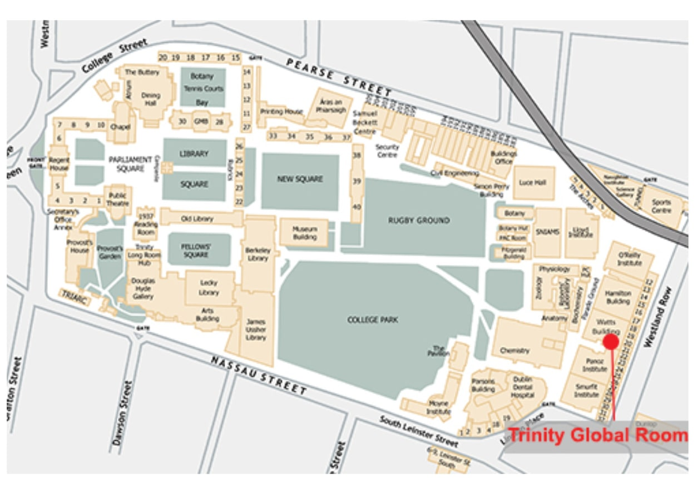

# International Student Orientation

> **Original title:** International Student Orientation  
> **Session date:** 7 September 2026  
> **Source:** [Panopto recording](https://tcd.cloud.panopto.eu/Panopto/Pages/Viewer.aspx?id=6cd67c9f-7681-4439-99ae-b4b700e99f2b)

## International student support

### Trinity Global Room

The **Trinity Global Room** is TCD's support and community hub for international students. More than 40 international and Irish student ambassadors provide peer advice, referrals, and social support. During term, it is open Monday to Friday, 09:00–21:00.

The Global Room is on the first floor of the Watts Building, beside Academic Registry.

*The Global Room is marked beside the Watts Building, near Westland Row and Academic Registry.*

It runs immigration clinics, orientation sessions, and cultural events. Contact `tcdglobalroom@tcd.ie`; current events and clinic times are published through `@tcdglobalroom`.

## Immigration registration

Students who are not citizens of the EU, EEA, United Kingdom, or Switzerland generally register with Immigration Service Delivery (ISD) before their entry permission expires, commonly within 90 days of arrival.

### Stamp 2 and Stamp 2A

| Permission | Typical category | Employment |
| --- | --- | --- |
| **Stamp 2** | Full-time degree student, including a full-time master's student | Up to 20 hours per week during term and 40 hours during designated holiday periods, subject to current rules |
| **Stamp 2A** | Exchange or visiting student attending for one semester | Does not carry the Stamp 2 employment permission described in the session |

A one-year full-time master's degree belongs to the full-time degree category, not the one-semester exchange category.

### Registration workflow

1. Book through the ISD portal for a date after the official course start date. Identity verification may use ID-Pal.
2. Generate proof of registration within one week of the appointment.
3. Attend the Burgh Quay Registration Office appointment with the required documents.
4. Pay the stated €300 fee with a physical debit or credit card. Cash and contactless payment are not accepted.

### Required evidence

| Evidence | Detail |
| --- | --- |
| Valid passport | Confirms identity and entry permission |
| Proof of registration | Generate through **Registration → Confirmation of Registration** in `my.tcd.ie`; retrieve it from the portal intray |
| Proof of fees paid | Often included in the Trinity registration letter |
| Proof of finances | Required for non-visa-required nationals; the amount depends on course duration and current ISD rules |
| Private health insurance | Must cover the period of residence and satisfy ISD requirements |
| Physical payment card | Used for the registration fee |

### Irish Residence Permit

The **Irish Residence Permit (IRP)** records the permission type and expiry date. It is posted to the address confirmed at the appointment. If it has not arrived within 15 working days, submit a query through the ISD customer-service portal.

Employment permission ends when the underlying immigration permission expires. Check the date printed on the IRP.

## Travel outside Ireland

Irish residence permission does not automatically authorize entry to another country.

- **Schengen Area:** Ireland is not part of the Schengen Area. A Schengen visa may be required.
- **United Kingdom and Northern Ireland:** An IRP does not authorize entry by itself. A visa or Electronic Travel Authorisation may be required, depending on nationality and purpose.
- **Applications:** Each embassy sets its own evidence requirements. Appointment availability may be limited.

## Banking, work, and public services

| System | Purpose |
| --- | --- |
| Irish bank account | Receives wages and supports local payments; it is not required for immigration registration |
| PPS number | Identifies a person for employment, tax, social welfare, and some public services |

Bank requirements vary. Common evidence includes a passport, proof of Irish address, proof of student status, and sometimes an IRP or home-country bank statement.

Apply for a **Personal Public Service number (PPSN)** through MyWelfare after creating a MyGovID account. Typical evidence includes identity, an Irish address, and the reason for applying. A current Trinity registration letter may support student status and address.

## Health insurance

Non-EU students must maintain private medical insurance that meets immigration requirements. Coverage should span the full period of residence and include emergency treatment and hospitalization.

Providers mentioned in the session include Irish Life Health, VHI, Laya Healthcare, and Study & Protect. First-year students may use home-country insurance if it satisfies ISD requirements.

## Safety and scams

### SafeZone

**SafeZone** is Trinity's campus safety application. It can share the user's location with campus security and provides routes for first aid, non-urgent assistance, and emergencies.

### Scam response

Accommodation, banking, and immigration scams often create artificial urgency.

1. Pause the transaction or conversation.
2. Verify the website domain and organization independently.
3. Use an official contact number found separately from the message.
4. Do not disclose passwords, verification codes, or banking credentials by phone.

## Cultural adaptation

**Global dexterity** is the ability to adjust behaviour across cultural contexts while retaining personal values and identity.

| Visible culture | Less visible culture |
| --- | --- |
| Food, clothing, music, celebrations, and signage | Communication style, disagreement, authority, formality, and academic norms |

Irish communication may be indirect. Phrases such as “That's interesting” or “I'll see what I can do” can soften disagreement or refusal. Ask for repetition, slower speech, or rephrasing when an accent or expression affects understanding, especially in academic meetings.

### Common Irish and Trinity terms

| Term | Meaning |
| --- | --- |
| **An Lár** | City centre |
| **An Post** | Postal service or post office |
| **Fir / Mná** | Men / women |
| **Gardaí / the Guards** | Police |
| **the craic** | Fun, news, or what is happening |
| **yoke** | An unspecified object |
| **College** | Often Trinity within the university community |
| **Michaelmas term** | Semester 1 |
| **Hilary term** | Semester 2 |
| **module** | Course unit or class |
| **invigilator** | Examination supervisor |
| **Provost** | Trinity's institutional president |

## Practical sequence

| Stage | Action |
| --- | --- |
| Arrival | Update the Irish address in Trinity systems, locate the Global Room, and configure SafeZone |
| Before registration | Confirm the immigration category, book through the ISD portal, and generate current evidence |
| After registration | Check the IRP details and delivery |
| Before employment | Confirm Stamp 2 work permission, then arrange a suitable bank account and PPSN |
| Before travel | Check the destination's entry requirements independently |
| During term | Clarify unfamiliar language early and build an academic and social support network |

## Source-linked resources

- [ISD registration portal](https://portal.irishimmigration.ie/)
- [ISD Stamp 2 document requirements](https://www.irishimmigration.ie/required-documents/#stamp2)
- [TCD visa and immigration guidance](https://www.tcd.ie/study/international/arriving-in-ireland/visa-immigration/)
- [Irish Department of Foreign Affairs travel advice](https://www.dfa.ie/travel/)
- [Citizens Information: Personal Public Service Number](https://www.citizensinformation.ie/en/social-welfare/irish-social-welfare-system/personal-public-service-number/)
- [TCD jargon buster](https://www.tcd.ie/students/jargon-buster/)
- [TCD Welcome Guide 2026](https://www.tcd.ie/study/assets/pdfs/Welcome-To-Trinity-2026.pdf)
